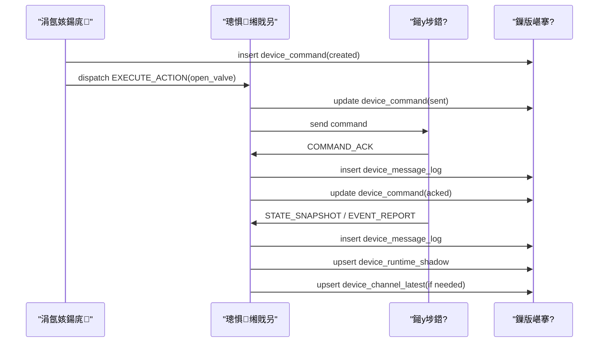
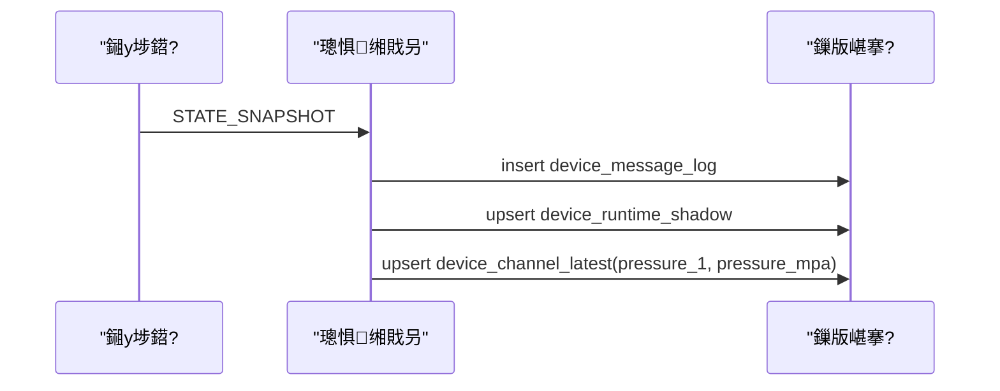
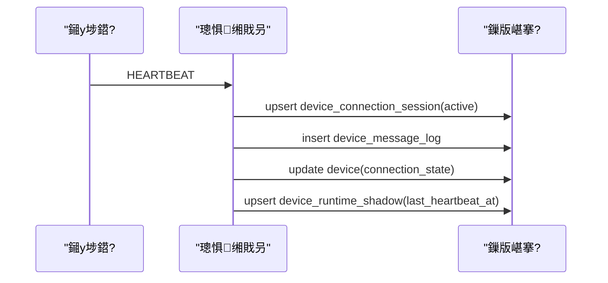

# Embedded Controller Runtime Schema Migration Draft v1

## 1. 鏂囨。鐩殑

杩欎唤鏂囨。鎶婁笂涓€鐗堝瓨鍌ㄤ笌缂撳瓨璁捐缁х画寰€鍓嶆帹杩涗竴灞傦紝鐩存帴缁欏嚭锛?
- 鏂板琛ㄥ瓧娈垫竻鍗?- 绱㈠紩寤鸿
- 鏇存柊鏃舵満
- 涓€鐗?SQL migration 鑽夋
- `runtime-ingest` 搴旇鎬庝箞鎶婃秷鎭惤鍒拌繖浜涜〃

杩欎唤鏂囨。鏄€滃悗绔彲钀藉簱銆佸彲寮€宸モ€濈殑鑽夋锛屼笉鍙槸姒傚康璇存槑銆?
涓昏鍙傝€冿細

- [embedded-controller-storage-cache-spec-v1.md](D:/Develop/houji/houjinongfuAI-Cursor/houjinongfuai-working/docs/protocol/embedded-controller/embedded-controller-storage-cache-spec-v1.md)
- [006_device_runtime_foundation.sql](D:/Develop/houji/houjinongfuAI-Cursor/houjinongfuai-working/backend/sql/migrations/006_device_runtime_foundation.sql)
- [device-gateway.service.ts](D:/Develop/houji/houjinongfuAI-Cursor/houjinongfuai-working/backend/src/modules/device-gateway/device-gateway.service.ts)
- [tcp-json-v1.adapter.ts](D:/Develop/houji/houjinongfuAI-Cursor/houjinongfuai-working/backend/src/modules/protocol-adapter/tcp-json-v1.adapter.ts)

## 2. 鐜扮姸鍒ゆ柇

褰撳墠閾捐矾宸茬粡鏈変簡 4 绫荤湡鐩告簮锛?
- 璁惧闈欐€侀厤缃細`device_type`銆乣device`
- 杩炴帴鐪熺浉锛歚device_connection_session`
- 娑堟伅鐪熺浉锛歚device_message_log`
- 鍛戒护鐪熺浉锛歚device_command`
- 涓氬姟浼氳瘽鐪熺浉锛歚runtime_session`銆乣session_status_log`

浣嗚繕缂哄皯 2 绫烩€滈潰鍚戦珮棰戞煡璇㈢殑鏈€鏂版€佽〃鈥濓細

- 鎺у埗鍣ㄦ渶鏂板揩鐓?- 閫氶亾鏈€鏂版祴鐐?
杩欐鏄綋鍓嶅伐浣滃彴銆佺洃鎺ч〉銆佽繍琛岀湅鏉垮悗闈㈡渶瀹规槗瓒婃煡瓒婇噸鐨勭偣銆?
## 3. 鐩爣琛ㄧ粨鏋?
鏈疆寤鸿鍙柊澧?2 寮犺〃锛屼笉瑕佷竴娆℃墿澶ぇ锛?
1. `device_runtime_shadow`
2. `device_channel_latest`

鍗囩骇浠诲姟琛?`device_upgrade_job` 寤鸿鐣欏埌涓嬩竴杞紝涓嶄綔涓鸿繖娆＄‖鍓嶇疆銆?
## 4. 琛ㄤ竴锛歞evice_runtime_shadow

## 4.1 璁捐鐩爣

姣忓彴鎺у埗鍣?1 琛岋紝淇濈暀鏈€鏂版憳瑕佺姸鎬併€?
鍏稿瀷浣跨敤鏂癸細

- 椤圭洰杩愯鐩戞帶鍒楄〃
- 宸ヤ綔鍙版帶鍒跺櫒渚ф爮
- 鍦板潡鎺у埗鍣ㄦ瑙?- 棣栭〉璁惧鍦ㄧ嚎/ready/鍛婅缁熻

## 4.2 瀛楁娓呭崟

| 瀛楁 | 绫诲瀷 | 蹇呭～ | 璇存槑 |
| --- | --- | --- | --- |
| `id` | `uuid` | 鏄?| 涓婚敭 |
| `tenant_id` | `uuid` | 鏄?| 绉熸埛 |
| `device_id` | `uuid` | 鏄?| 瀵瑰簲 `device.id` |
| `imei` | `varchar(32)` | 鏄?| 閫氫俊涓婚敭 |
| `project_id` | `uuid` | 鍚?| 鍐椾綑椤圭洰褰掑睘锛屾柟渚垮垪琛ㄧ瓫閫?|
| `block_id` | `uuid` | 鍚?| 鍐椾綑鍦板潡褰掑睘锛屾柟渚垮垪琛ㄧ瓫閫?|
| `source_node_code` | `varchar(64)` | 鍚?| 瀵瑰簲鐐逛綅鑺傜偣缂栫爜 |
| `last_msg_id` | `varchar(128)` | 鍚?| 鏈€杩戜竴娆℃秷鎭?id |
| `last_seq_no` | `integer` | 鍚?| 鏈€杩戝簭鍙?|
| `last_msg_type` | `varchar(64)` | 鍚?| 鏈€杩戞秷鎭被鍨?|
| `last_device_ts` | `timestamptz` | 鍚?| 璁惧鎶ユ枃鏃堕棿 |
| `last_server_rx_ts` | `timestamptz` | 鍚?| 鏈嶅姟绔帴鏀舵椂闂?|
| `last_heartbeat_at` | `timestamptz` | 鍚?| 鏈€杩戝績璺虫椂闂?|
| `last_snapshot_at` | `timestamptz` | 鍚?| 鏈€杩戠姸鎬佸揩鐓ф椂闂?|
| `last_event_at` | `timestamptz` | 鍚?| 鏈€杩戜簨浠舵椂闂?|
| `connection_state` | `varchar(16)` | 鏄?| `connected/disconnected` |
| `online_state` | `varchar(16)` | 鏄?| `online/offline/alarm` |
| `workflow_state` | `varchar(32)` | 鍚?| `READY_IDLE/RUNNING/...` |
| `run_state` | `varchar(32)` | 鍚?| 璁惧鎶ユ枃閲岀殑 run_state |
| `power_state` | `varchar(32)` | 鍚?| 璁惧鎶ユ枃閲岀殑 power_state |
| `ready` | `boolean` | 鏄?| 鏄惁 ready |
| `config_version` | `integer` | 鍚?| 褰撳墠鐢熸晥閰嶇疆鐗堟湰 |
| `firmware_family` | `varchar(64)` | 鍚?| 鍥轰欢瀹舵棌 |
| `firmware_version` | `varchar(64)` | 鍚?| 鍥轰欢鐗堟湰 |
| `signal_csq` | `integer` | 鍚?| 淇″彿寮哄害 |
| `signal_rsrp` | `integer` | 鍚?| 4G RSRP |
| `battery_soc` | `numeric(5,2)` | 鍚?| 鐢垫睜鐢甸噺鐧惧垎姣?|
| `battery_voltage` | `numeric(10,3)` | 鍚?| 鐢垫睜鐢靛帇 |
| `solar_voltage` | `numeric(10,3)` | 鍚?| 澶槼鑳借緭鍏?|
| `alarm_codes_json` | `jsonb` | 鏄?| 褰撳墠鍛婅鐮佹暟缁?|
| `common_status_json` | `jsonb` | 鏄?| 鏈€杩戜竴娆?common_status 鎽樿 |
| `module_states_json` | `jsonb` | 鏄?| 鏈€杩戜竴娆?module_states 鎽樿 |
| `last_command_id` | `uuid` | 鍚?| 鏈€杩戝叧鑱斿懡浠?|
| `updated_at` | `timestamptz` | 鏄?| 鏈€鍚庢洿鏂版椂闂?|
| `created_at` | `timestamptz` | 鏄?| 鍒涘缓鏃堕棿 |

## 4.3 鍞竴绾︽潫涓庣储寮?
蹇呴』鏈夛細

- 鍞竴閿細`(tenant_id, device_id)`
- 鍞竴閿細`(tenant_id, imei)`

鎺ㄨ崘绱㈠紩锛?
- `(tenant_id, project_id, block_id)`
- `(tenant_id, connection_state, online_state)`
- `(tenant_id, workflow_state)`
- `(tenant_id, ready, updated_at desc)`

## 5. 琛ㄤ簩锛歞evice_channel_latest

## 5.1 璁捐鐩爣

姣忎釜閫氶亾/娴嬬偣鍙繚鐣欐渶鏂板€笺€?
鍏稿瀷浣跨敤鏂癸細

- 鏈€鏂板帇鍔?- 鏈€鏂版祦閲?- 鏈€鏂扮數琛ㄨ鏁?- 鏈€鏂板鎯?- 鏈€鏂版恫浣?
## 5.2 瀛楁娓呭崟

| 瀛楁 | 绫诲瀷 | 蹇呭～ | 璇存槑 |
| --- | --- | --- | --- |
| `id` | `uuid` | 鏄?| 涓婚敭 |
| `tenant_id` | `uuid` | 鏄?| 绉熸埛 |
| `device_id` | `uuid` | 鏄?| 瀵瑰簲鎺у埗鍣?|
| `imei` | `varchar(32)` | 鏄?| 閫氫俊涓婚敭 |
| `project_id` | `uuid` | 鍚?| 鍐椾綑椤圭洰褰掑睘 |
| `block_id` | `uuid` | 鍚?| 鍐椾綑鍦板潡褰掑睘 |
| `source_node_code` | `varchar(64)` | 鍚?| 鏉ユ簮鐐逛綅 |
| `module_code` | `varchar(64)` | 鏄?| 妯″潡鐮?|
| `module_instance_code` | `varchar(64)` | 鍚?| 妯″潡瀹炰緥鐮?|
| `channel_code` | `varchar(64)` | 鏄?| 閫氶亾缂栫爜 |
| `metric_code` | `varchar(64)` | 鏄?| 鎸囨爣缂栫爜 |
| `value_num` | `numeric(18,6)` | 鍚?| 鏁板€煎瀷鍊?|
| `value_text` | `text` | 鍚?| 鏂囨湰鍨嬪€?|
| `unit` | `varchar(32)` | 鍚?| 鍗曚綅 |
| `quality` | `varchar(32)` | 鍚?| 璐ㄩ噺鐮?|
| `fault_codes_json` | `jsonb` | 鏄?| 璇ラ€氶亾鏁呴殰鐮?|
| `collected_at` | `timestamptz` | 鍚?| 璁惧閲囬泦鏃堕棿 |
| `server_rx_ts` | `timestamptz` | 鍚?| 鏈嶅姟绔帴鏀舵椂闂?|
| `last_msg_id` | `varchar(128)` | 鍚?| 鏉ユ簮娑堟伅 id |
| `last_seq_no` | `integer` | 鍚?| 鏉ユ簮搴忓彿 |
| `updated_at` | `timestamptz` | 鏄?| 鏈€鍚庢洿鏂版椂闂?|
| `created_at` | `timestamptz` | 鏄?| 鍒涘缓鏃堕棿 |

## 5.3 鍞竴绾︽潫涓庣储寮?
蹇呴』鏈夛細

- 鍞竴閿細`(tenant_id, imei, channel_code, metric_code)`

鎺ㄨ崘绱㈠紩锛?
- `(tenant_id, project_id, block_id)`
- `(tenant_id, device_id, updated_at desc)`
- `(tenant_id, metric_code, updated_at desc)`
- `(tenant_id, source_node_code, metric_code)`

## 6. 鍚勮〃鏇存柊鏃堕棿

## 6.1 REGISTER

鏇存柊锛?
- `device`
- `device_connection_session`
- `device_message_log`
- `device_runtime_shadow`

涓嶆洿鏂帮細

- `device_channel_latest`
- `runtime_session`

## 6.2 HEARTBEAT

鏇存柊锛?
- `device.last_device_ts`
- `device.connection_state`
- `device_message_log`
- `device_runtime_shadow`

閫氬父鍙洿鏂帮細

- `last_heartbeat_at`
- `signal_*`
- `battery_*`
- `power_mode`

## 6.3 STATE_SNAPSHOT

鏇存柊锛?
- `device_message_log`
- `device_runtime_shadow`
- `device_channel_latest`

蹇呰鏃惰仈鍔ㄦ洿鏂帮細

- `runtime_session`
- `session_status_log`

姣斿 snapshot 閲屽凡缁忎綋鐜?workflow 浠?`STARTING -> RUNNING`銆?
## 6.4 EVENT_REPORT

鏇存柊锛?
- `device_message_log`
- `device_runtime_shadow`
- 瑙嗕簨浠剁被鍨嬫洿鏂?`device_channel_latest`
- 瑙嗕笟鍔＄被鍨嬫洿鏂帮細
  - `runtime_session`
  - `session_status_log`
  - `irrigation_order`

## 6.5 COMMAND_ACK / COMMAND_NACK

鏇存柊锛?
- `device_message_log`
- `device_command`
- `runtime_session`
- 鍏抽敭鎯呭喌涓嬪悓姝ユ洿鏂?`device_runtime_shadow.last_command_id`

## 7. 寤鸿鐨?runtime-ingest 澶勭悊椤哄簭

褰撳墠 `runtime-ingest` 杩樻槸 skeleton銆傚缓璁悗缁湡姝ｈ惤鍦版椂鎸夊浐瀹氶『搴忓鐞嗭細

1. `protocol-adapter`
   - 鍘熷 JSON -> `DeviceEnvelope`
2. 骞傜瓑妫€鏌?   - 鍏堟煡 `device_message_log`
3. 鍐欐秷鎭祦姘?   - `device_message_log`
4. 鏇存柊鎺у埗鍣ㄦ憳瑕?   - `device_runtime_shadow`
5. 鏇存柊閫氶亾鏈€鏂板€?   - `device_channel_latest`
6. 鑻ュ懡涓懡浠ゅ洖鎵?   - 鏇存柊 `device_command`
7. 鑻ュ懡涓?workflow 浜嬩欢
   - 鏇存柊 `runtime_session`
   - 鍐?`session_status_log`
8. 鑻ュ懡涓祫閲?鍋滄満
   - 鏇存柊 `irrigation_order`

## 8. 鍏稿瀷鏁版嵁娴?
## 8.1 骞冲彴涓嬪彂寮€闃€



## 8.2 璁惧涓婃姤鍘嬪姏



## 8.3 璁惧蹇冭烦鎭㈠



## 9. migration 鑽夋

涓嬮潰杩欑増鏄缓璁?SQL 鑽夋锛屽厛鏀炬枃妗ｏ紝涓嶇洿鎺ュ叆姝ｅ紡 migration 搴忓垪銆?
```sql
create table if not exists device_runtime_shadow (
  id uuid primary key default gen_random_uuid(),
  tenant_id uuid not null references tenant(id),
  device_id uuid not null references device(id),
  imei varchar(32) not null,
  project_id uuid null references project(id),
  block_id uuid null references project_block(id),
  source_node_code varchar(64) null,
  last_msg_id varchar(128) null,
  last_seq_no integer null,
  last_msg_type varchar(64) null,
  last_device_ts timestamptz null,
  last_server_rx_ts timestamptz null,
  last_heartbeat_at timestamptz null,
  last_snapshot_at timestamptz null,
  last_event_at timestamptz null,
  connection_state varchar(16) not null default 'disconnected',
  online_state varchar(16) not null default 'offline',
  workflow_state varchar(32) null,
  run_state varchar(32) null,
  power_state varchar(32) null,
  ready boolean not null default false,
  config_version integer null,
  firmware_family varchar(64) null,
  firmware_version varchar(64) null,
  signal_csq integer null,
  signal_rsrp integer null,
  battery_soc numeric(5,2) null,
  battery_voltage numeric(10,3) null,
  solar_voltage numeric(10,3) null,
  alarm_codes_json jsonb not null default '[]'::jsonb,
  common_status_json jsonb not null default '{}'::jsonb,
  module_states_json jsonb not null default '[]'::jsonb,
  last_command_id uuid null references device_command(id),
  created_at timestamptz not null default now(),
  updated_at timestamptz not null default now()
);

create unique index if not exists ux_device_runtime_shadow_tenant_device
  on device_runtime_shadow (tenant_id, device_id);

create unique index if not exists ux_device_runtime_shadow_tenant_imei
  on device_runtime_shadow (tenant_id, imei);

create index if not exists ix_device_runtime_shadow_project_block
  on device_runtime_shadow (tenant_id, project_id, block_id);

create index if not exists ix_device_runtime_shadow_conn_state
  on device_runtime_shadow (tenant_id, connection_state, online_state);

create index if not exists ix_device_runtime_shadow_workflow_state
  on device_runtime_shadow (tenant_id, workflow_state);


create table if not exists device_channel_latest (
  id uuid primary key default gen_random_uuid(),
  tenant_id uuid not null references tenant(id),
  device_id uuid not null references device(id),
  imei varchar(32) not null,
  project_id uuid null references project(id),
  block_id uuid null references project_block(id),
  source_node_code varchar(64) null,
  module_code varchar(64) not null,
  module_instance_code varchar(64) null,
  channel_code varchar(64) not null,
  metric_code varchar(64) not null,
  value_num numeric(18,6) null,
  value_text text null,
  unit varchar(32) null,
  quality varchar(32) null,
  fault_codes_json jsonb not null default '[]'::jsonb,
  collected_at timestamptz null,
  server_rx_ts timestamptz null,
  last_msg_id varchar(128) null,
  last_seq_no integer null,
  created_at timestamptz not null default now(),
  updated_at timestamptz not null default now()
);

create unique index if not exists ux_device_channel_latest_imei_channel_metric
  on device_channel_latest (tenant_id, imei, channel_code, metric_code);

create index if not exists ix_device_channel_latest_project_block
  on device_channel_latest (tenant_id, project_id, block_id);

create index if not exists ix_device_channel_latest_device_updated
  on device_channel_latest (tenant_id, device_id, updated_at desc);

create index if not exists ix_device_channel_latest_metric_updated
  on device_channel_latest (tenant_id, metric_code, updated_at desc);
```

## 10. upsert 寤鸿

## 10.1 device_runtime_shadow

寤鸿鎸?`(tenant_id, imei)` upsert銆?
鍘熷洜锛?
- `imei` 鏄€氫俊涓婚敭
- 鍦?TCP 鎺ュ叆閾句腑鏈€鍏堟嬁鍒扮殑灏辨槸 `imei`

## 10.2 device_channel_latest

寤鸿鎸?`(tenant_id, imei, channel_code, metric_code)` upsert銆?
鍘熷洜锛?
- 鍚屼竴璁惧鍚屼竴閫氶亾鍚屼竴鎸囨爣鍙繚鐣欐渶鏂板€?
## 11. 寤鸿鐨勪唬鐮佹敼閫犻『搴?
1. 寤鸿〃 migration
2. 鍦?`runtime-ingest` 涓ˉ repository
3. 瀹炵幇 `STATE_SNAPSHOT` -> `device_runtime_shadow`
4. 瀹炵幇 `STATE_SNAPSHOT` -> `device_channel_latest`
5. 瀹炵幇 `EVENT_REPORT` -> workflow 浼氳瘽鎺ㄨ繘
6. 鏈€鍚庡啀鎶婄洃鎺?宸ヤ綔鍙版煡璇㈠垏鍒板揩鐓ц〃

## 12. 鏈€缁堝缓璁?
濡傛灉浣犱滑鐜板湪瑕佺湡姝ｆ帹杩涙帶鍒跺櫒鎺ュ叆锛屾垜寤鸿鍚庣鏁版嵁搴撳眰鐨勪笅涓€姝ュ氨鍋氳繖 3 浠朵簨锛?
1. 鏂板 `device_runtime_shadow`
2. 鏂板 `device_channel_latest`
3. 鎶?`runtime-ingest` 浠?skeleton 鍙樻垚鐪熷疄鍏ュ簱閾?
杩欐槸褰撳墠鏁存潯閾捐矾閲屾€т环姣旀渶楂樼殑涓€姝ャ€?
