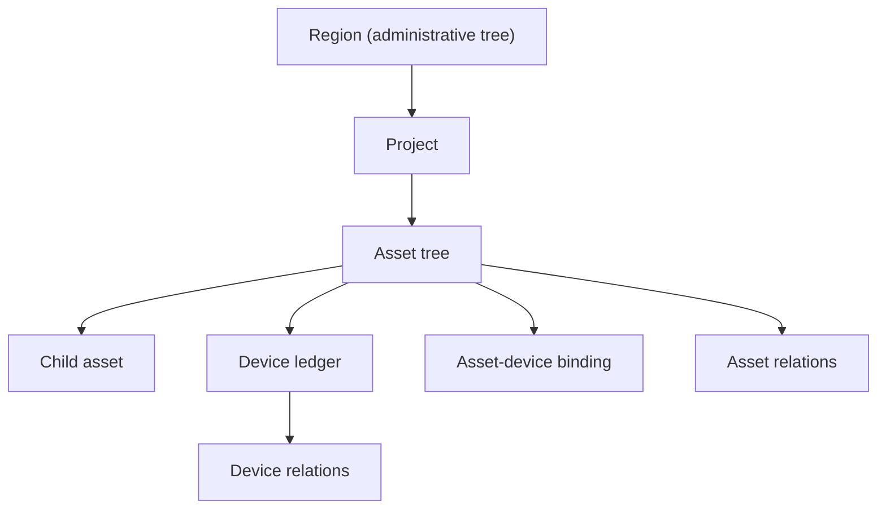

# Domain Model Freeze v2: Region -> Project -> Asset -> Device

Status: frozen semantic reference  
Audience: frontend, backend, UAT, and future CRUD planning

## Why this document exists

The first CRUD exploration treated `wells`, `devices`, and `pump-valve-relations` too directly as final top-level objects. That is no longer safe enough.

This document freezes the domain layering before more frontend CRUD work continues.

## Canonical layering

## 1. Region

Region is an administrative tree only.

Required fields:

- `id`
- `parent_id`
- `level`
- `code`
- `name`
- `full_path_name`
- `full_path_code`
- `enabled`

Administrative levels for the current freeze:

- `province`
- `city`
- `county`
- `town`
- `village`

Important rule:

- Region is not a generic bucket for project, asset, runtime, or workflow semantics.

## 2. Project

Project hangs under one primary region.

Required fields:

- `id`
- `project_code`
- `project_name`
- `region_id`
- `status`
- `owner`
- `operator`
- `remarks`

Important rule:

- One project belongs to one primary region in the current phase.
- Cross-region projects may be supported later, but not in this freeze.

## 3. Asset

Asset hangs under project and supports parent/child tree structure.

Required fields:

- `id`
- `asset_code`
- `asset_name`
- `asset_type`
- `parent_asset_id`
- `project_id`
- derived `region_id`
- `lifecycle_status`
- `install_status`

Examples of asset types in the current freeze:

- `well`
- `pump_station`
- `weather_point`
- `pump`
- `pipe`
- `elbow`
- `valve_group`
- `control_zone`
- `power_box`
- `well_house`

Important rules:

- A primary asset may own child assets.
- Asset tree expresses structural containment.
- Asset is the correct layer for physical or structural objects that do not independently communicate as the system-of-record identity.

## 4. Device

Device hangs under asset.

Required fields:

- `id`
- `device_code`
- `device_name`
- `device_type_id`
- `asset_id`
- derived `project_id`
- derived `region_id`
- communication identity fields
- runtime status fields

Device ledger should cover all recognized physical device types, for example:

- well controller
- pump controller
- smart valve controller
- weather station terminal
- flow meter
- pressure sensor
- gateway
- camera
- collector

Important rules:

- Device is the right layer for anything that can be independently identified, communicate, report, or receive commands.
- Device is not the same thing as the asset it belongs to.

## 5. Well versus controller

Frozen interpretation:

- `well` = asset
- `well controller` = device

This also applies to similar cases:

- a pump may exist as an asset
- a pump controller is a device

Dual-view modeling is allowed:

- one physical object may have an asset record
- and also have one or more device records representing communication/control endpoints

## 6. What the current specialized tables mean under the new model

- current `well` table
  - compatibility slice for `asset_type = well`
- current `pump` table
  - compatibility slice for `asset_type = pump`
- current `valve` table
  - compatibility slice for a valve-related asset type
- current `device` table
  - device ledger, still valid as the device layer

Important rule:

- This document freezes semantics first.
- It does not require renaming all current tables or APIs in this turn.
